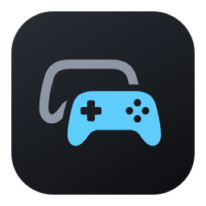
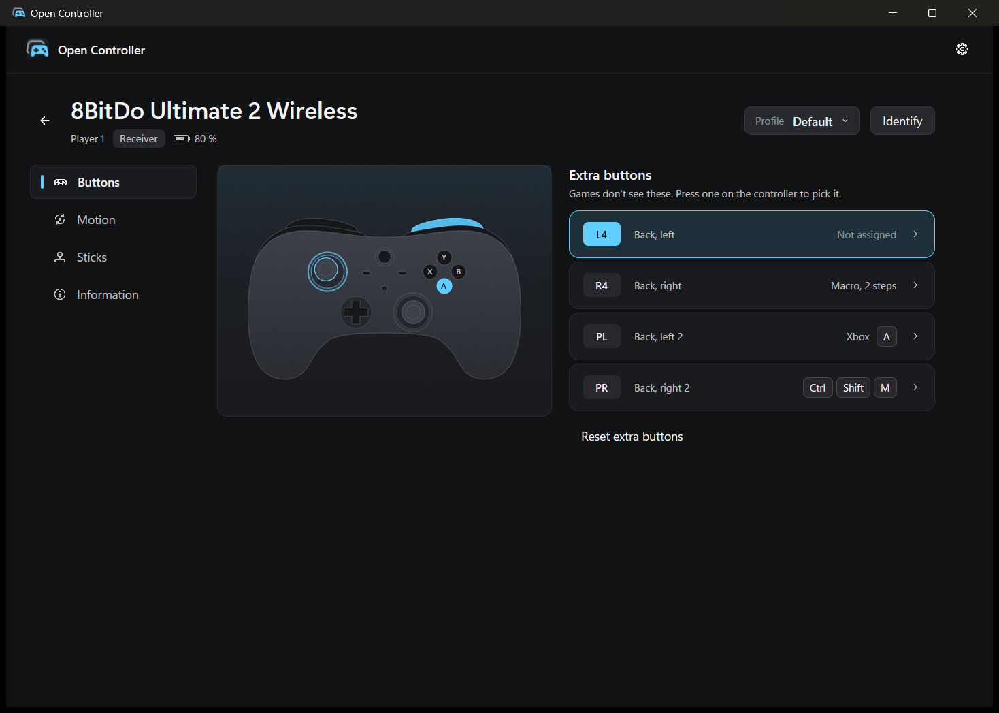

# OpenController



An app for Windows and Linux that makes any game controller work in any game, with a smaller
version for macOS. Every controller connected to the computer becomes an Xbox controller that games
understand: a DualSense on Bluetooth, a Switch Pro
Controller on a cable and a DualShock 4 on Sony's receiver, all at once, each as its own player.
There is nothing to map. The buttons an Xbox controller lacks (back paddles, L4 and R4, Capture,
the touchpad) can press an Xbox button, hold a key or type a macro instead, and a controller with a
gyro can aim by turning it.

It works with the several hundred controllers SDL knows and keeps out of the way: a resident process of 3.2 MB that adds about 0.6 ms between the
controller and the game. Xbox controllers are left alone, since games already read them. The
window is a separate program that only exists while it is open.

OpenController is open source (MIT) and in beta, at version 0.8.2. With so many controllers out
there, some will not work as they should yet and some features are still missing, so every report
helps. If your controller is not recognised, a button does nothing or anything else goes wrong,
feel free to [open an issue](https://github.com/Brunovncs/OpenController/issues); see
[Reporting a problem](#reporting-a-problem) for what to include.

The official website is [opencontroller.com.br](https://opencontroller.com.br). It is the only one:
OpenController has no other site, and its downloads come only from there or from this repository.


## Installing

Every download is on the [latest release](https://github.com/Brunovncs/OpenController/releases/latest),
with its SHA-256 next to it.

### Windows

Download `open-controller-0.8.2-windows-x64-setup.exe` and run it. It installs for your user only,
without administrator rights, adds OpenController to the Start menu and to Apps in Settings
(where it uninstalls), and starts it. Run it again over an existing installation, or let the app
do it, and it updates in place: the running copy quits first, and your settings, kept in
`%APPDATA%\io.github.brunovncs.open-controller`, stay. Uninstalling asks whether to delete them
too. The installer is not code-signed, so
SmartScreen warns the first time ("More info", then "Run anyway").

To run it without installing, download `open-controller-0.8.2-windows-x64.zip`, extract it anywhere
and run `open-controller.exe`. The programs are not code-signed yet, so Windows SmartScreen warns
on the first start ("More info", then "Run anyway"). Neither the app nor its installation needs
administrator rights.

OpenController needs two free drivers by Nefarius:
[ViGEmBus](https://github.com/nefarius/ViGEmBus), which creates the virtual Xbox controllers games
see, and [HidHide](https://github.com/nefarius/HidHide), which hides the original controllers from
games so a game that also understands a DualSense does not see it twice. ViGEmBus is required and
HidHide recommended. Settings, Requirements in the window shows whether each is installed and in
which version, and installs or updates it when you click; the same page offers DsHidMini and
BthPS3, which a DualShock 3 needs. Nothing is installed on its own.

Settings, Advanced can switch the virtual controllers to [VIIPER](https://github.com/Alia5/VIIPER)
instead. It is experimental and off by default, and ViGEmBus stays the recommended choice. VIIPER
makes the same Xbox 360 controllers with [usbip-win2](https://github.com/vadimgrn/usbip-win2), a
USB/IP driver, and a small server program that OpenController starts and stops. With VIIPER
chosen, Requirements offers both: usbip-win2 needs administrator rights and a restart, and the
server is unpacked next to OpenController. Switching makes the virtual controllers again, so close
your games first. If VIIPER does not start, OpenController goes back to ViGEmBus and says so.

To build and install from source instead, with Windows 10 or 11 and [Rust](https://rustup.rs):

```powershell
.\install.ps1     # builds, installs to %LOCALAPPDATA%\Programs\open-controller, adds a Start menu entry and starts it
.\uninstall.ps1   # quits it, shows any hidden controller again and removes the program and its settings
```

OpenController lives in the notification area: its icon opens the window and has "Start with
Windows" and "Quit". Closing the window does not stop anything.

### Linux

Download `open-controller-0.8.2-linux-x64.tar.gz` (built on Ubuntu 22.04; any distribution as
recent works), extract it and run `./install.sh`. It installs the two programs to `~/.local/bin`
with an entry in your applications menu, and a udev rule, which asks for your password once. The
rule lets the user at the seat create virtual controllers through `/dev/uinput` and read the HID
reports of the controllers in the model table (their extra buttons, gyro and light), as Steam's
own rules do; without it OpenController can do neither. `./install.sh --no-rule` skips it, and
Settings, Requirements in the window installs it later through polkit. Run with `sudo`, the script
installs for the user who ran it. It stops with an error when the rule can't be installed or the
kernel has no uinput, as on WSL. `./uninstall.sh` removes it all again and asks whether to delete
your settings too.

The window needs `libxkbcommon-x11` (`libxkbcommon-x11-0` on Ubuntu and Debian, `libxkbcommon-x11`
on Fedora and Arch) and Vulkan or OpenGL drivers, which desktops have; `install.sh` lists any
library that is missing. The resident process runs in the background without an icon of its own:
the window is opened from the applications menu, and "Start when you sign in" adds an XDG
autostart entry.

Games that read a PlayStation or Nintendo controller directly, as Steam Input and many SDL games
do, still see it next to its Xbox controller, so a press can count twice. Turn off PlayStation and
Nintendo support in Steam's controller settings if that happens. The touchpad of a PlayStation
controller keeps moving the pointer, as it does without OpenController.

### macOS

Download `open-controller-0.8.2-macos-arm64.zip` (Apple silicon) or `-macos-x64.zip` (Intel) and
move OpenController to Applications. It is not notarised: the first time, open it with a
right-click and Open. macOS lets no program create game controllers without an entitlement Apple
grants case by case, and games there already read PlayStation, Xbox and Switch Pro controllers
directly, so on macOS OpenController leaves controllers as they are and adds what games do not
do: extra buttons as keys and macros, the light bar and its low-battery blink, battery levels and
profiles. Typing keys for other apps needs the Accessibility permission, which the window asks for.

## What it does

Every controller gets a player slot. Games see an Xbox 360 controller in that XInput slot, and the
physical controller shows the same number: the player lights on a DualSense or a Switch controller,
the light bar colour on a DualShock 4 (blue, red, green, pink, as on a PlayStation). Buttons follow
their position, so the bottom face button is A whether it says Cross, B or A. Sticks and triggers
pass through untouched, without a deadzone, as a real Xbox controller's do; the game applies its
own. Rumble goes back the other way, from the game to the controller's motors.

Players can be swapped by dragging one controller's tile onto another's. The two trade virtual
controllers, so no game sees a controller leave; each one's lights follow its new number.

A slot belongs to the controller, not to the connection. A DualShock 4 or DualSense gives the same
Bluetooth address as its serial over Bluetooth and over USB, so plugging a cable into a DualSense
that was on Bluetooth moves it to the cable without the game noticing: the virtual controller
stays, same slot, same player. A controller that disappears keeps its slot for 15 seconds, which
covers a cable swap, a Bluetooth reconnect or a receiver hiccup; meanwhile the game sees it at
rest. A controller connected two ways at once (charging over USB while on Bluetooth) is one player,
driven by whichever connection sent the last input.

With HidHide installed, the originals are hidden from games while OpenController runs and shown
again when it quits. OpenController only touches its own entries in HidHide's configuration,
writes down what it hid before hiding it, and undoes it on the next start if it was killed in
between. Signing out or shutting down Windows quits it cleanly.

### The window

Each controller is a tile, drawn as it looks: the DualSense, DualSense Edge, DualShock 4 and 3,
the Xbox and Switch Pro controllers, Joy-Cons, the 8BitDo Ultimate and SN30 Pro shapes, Super
Nintendo style pads, handhelds and a generic pad, each with its outline, its controls where the
real one has them and details such as the DualSense's light strips or the Ultimate's star. Sticks,
triggers and buttons light up as they are pressed, next to the player, connection and battery.
The same drawings are on the [website](https://opencontroller.com.br). Icons are drawn too, so the window looks the same on
Windows, Linux and macOS. A controller's page has its profiles at the top and three
sections: Buttons, with the drawing and the extra buttons; Light, for controllers whose light bar
can be coloured; and Information, with the model, its USB id, what games see and what it can do.
"Identify" makes it rumble, and "Turn off" disconnects a Bluetooth PlayStation or Switch
controller.

Xbox controllers are listed but not duplicated: they are XInput controllers already, so they keep
their own slot and add no latency. Controllers SDL reads through XInput, which gives no name, get
the name Windows has for the device ("8BitDo Ultimate 2 Wireless Controller for PC" rather than
"XInput Controller"), and generic names are replaced from a table of 922 known models. A
controller that copies another's ids, as the Onikuma C1 copies the Switch Pro Controller's, can
be told which model it is under Model on its Information page, and takes that name and drawing.
The interface follows Windows' light or dark mode, and is in English or Brazilian Portuguese, picked in
Settings (English until you pick).



### Extra buttons

Buttons an Xbox controller does not have never reach games through a virtual Xbox controller, so
they are free to do something else. Each one, named as on the controller (L4, PL, Fn, Capture,
Mic), can be:

- an **Xbox button**, pressed while you hold it, like the paddles of an Elite controller;
- a **key or shortcut**, held while you hold it: press it to record it, or pick one you cannot
  press, such as F13 to F24 or the media keys;
- a **macro**: keys typed once per press, recorded with the gaps you left between them, which can
  be edited afterwards;
- nothing, which is where every button starts.

Some games, online ones with anti-cheat above all, do not allow macros or automated input. Check a
game's rules before using macros or shortcuts in it; what happens to an account for using them is
the player's responsibility.

Pressing an extra button on the controller picks it in the window. Changes apply as they are made
and follow the controller across cables and pairings when it reports a serial (Bluetooth
PlayStation, Switch and 8BitDo pads do); otherwise they belong to the model.

The touchpad gives three buttons of its own besides its click: a click on its left half, on its
right half, and two fingers on it, so a DualShock 4 or DualSense has a few to assign even without
back paddles.

Each controller has up to eight profiles, each with its own assignments, light, gyro and stick
settings. A new profile starts as a copy of the one in use, and switching applies at once, keys
held by the old profile included. A profile can name programs: while one of them is the window in
front, that profile is in use, and the chosen one again when it is not. Windows says when the
program in front changes, so nothing is polled, and only the assignments change, never the
players.

### Gyro and sticks

A controller with a gyro (DualShock 4, DualSense, Switch Pro, Joy-Cons, Steam Deck, 8BitDo pads in
D-input mode) can aim by turning it: its rotation is added to the right stick, always, only while
the left trigger is pulled (aiming down sights) or while a chosen button is held. That button can
also work as a switch: one press turns the gyro on, the next turns it off. The game still gets the
button. A half turn a second is the stick all the way at 100 % sensitivity; a small deadzone keeps
a still hand still, a filter smooths slow movement without delaying fast turns, and the stick
keeps working. Each friend aims with their own controller, which a gyro mapped to the mouse would
not allow.

The aim can be tuned further: a sensitivity of its own while the left trigger is pulled, a slower
or faster up and down, and a button that pauses the gyro while held, to put the controller back
without moving the aim. Under Advanced, acceleration makes fast turns go further so slow ones stay
precise, steadying shrinks movements slower than a few degrees a second so a shaking hand holds
still, and the gyro's anti-deadzone (12 % unless changed) sets the smallest push a slow turn gives.
Profiles from older versions aim as they did.

A worn stick that drifts can get a radial deadzone, and an anti-deadzone makes games react to the
first movement past it. Both are off unless set: games apply their own.

### Light bar

On a controller whose light bar SDL can colour (DualShock 4, DualSense, DualSense Edge and the
licensed pads that report one), the Light section sets what it shows: the player's colour, as a
PlayStation does, a colour of your choice, the battery (green when full to red when it needs
charging) or nothing, with four steps of brightness. Below 15 % on battery it blinks once a
second, unless that is turned off. The section only appears on controllers that have such a
light. The RGB lights of 8BitDo pads are set through 8BitDo's own protocol, which is not public,
and are left alone.

### Handheld PCs

On a handheld, the built-in controller is an XInput pad that games read directly, and its extra
buttons reach Windows as keys or through the maker's own HID interface. OpenController recognises
the machine by the name its firmware gives and reads them without writing anything to it: the
function keys of AYANEO, ZOTAC Gaming Zone and OneXPlayer models, caught and swallowed so they do
nothing else, and the HID reports of the Lenovo Legion Go, Go 2 and Go S (Y1 to Y3, M1 to M3, the
Legion buttons and the wheel's click). They can become keys and macros; Xbox buttons need a
virtual controller, which a built-in pad does not get. This comes from what other projects
document about these machines and has not been tried on one yet.

### Keeping a controller native

"Keep native" on a controller's page takes OpenController out of the way for that controller. No
Xbox controller is made for it, it is not hidden, and nothing is written to it: no light, no
player number, no rumble. Games see the real controller, so a game that knows a DualSense gets
its button prompts, adaptive triggers and, over the cable, haptic feedback. This is also the way
to use a DS5Dongle, which shows a Bluetooth DualSense to the PC as a wired one, or a DualSense on
Linux, where the kernel driver already passes almost everything on.

Profiles, gyro aiming and remapped buttons do not apply while a controller is native. Close the
game before switching: a game that is open does not notice the controller appear, and one that
already opened it keeps it after it goes back to Xbox, so it would read it twice. A controller
without a serial number shares its settings with every controller of its model, and so does this
choice. With "Hide original controllers" off, native only removes the Xbox controller.

## Supported controllers

Controllers are read through [SDL 3](https://libsdl.org), which speaks each one's own protocol,
plus the 869 Windows entries of the community
[SDL_GameControllerDB](https://github.com/mdqinc/SDL_GameControllerDB) for generic ones. A table of
922 controllers (from SDL's lists, the 8BitDo range, the ids Linux's drivers know, and the pads
sold today, old and retro ones that `scripts/models/sources.json` traces to their sources) gives
them their names, drawings and the advice the window shows.

Each controller has a grade, shown next to it in the window and on the website. Verified: tested
with OpenController on the controller itself. Compatible: a known model whose protocol SDL reads in
full. Works, with a note: something to know first, such as a mode to switch to. Not supported yet.
A controller off the table is "not on the list yet", and its page offers to send its details so it
can be added.

| | USB | Bluetooth | Receiver | Extra buttons |
|---|---|---|---|---|
| DualShock 4 (both versions) | yes | yes | Sony USB wireless adaptor | touchpad click |
| DualSense, Access controller | yes | yes | | mic, touchpad click |
| DualSense Edge | yes | yes | | back buttons, Fn buttons, mic, touchpad click |
| DualShock 3, Sixaxis | with DsHidMini | with DsHidMini and BthPS3 | | none |
| PlayStation and PlayStation 2 pads | through USB adapters | | | none |
| Switch Pro Controller and licensed pads | yes | yes | | Capture |
| Joy-Con (pair or single) | | yes | | Capture, SL and SR |
| Nintendo Switch Online SNES, N64, Mega Drive | | yes | | Capture on the N64 |
| 8BitDo Ultimate 2 Wireless, Ultimate 3, Pro 3 | yes | yes | yes | L4, R4, PL, PR in D-input mode |
| 8BitDo Pro 2 | yes | yes | yes | PL and PR in D-input mode |
| 8BitDo Ultimate (first), Ultimate 2C | yes | yes | yes | back buttons and the star button; L4 and R4 on the 2C over Bluetooth |
| 8BitDo SN30 Pro, Lite, Zero, M30 and the retro range | yes | yes | yes | none |
| Steam Deck, Steam Controller | yes | yes | yes | L4, R4, L5, R5, quick access, trackpad clicks; grips on the 2015 controller |
| Flydigi Vader, Apex | yes | | yes | M1 to M4, C and Z or LM and RM |
| Google Stadia, Amazon Luna, NVIDIA Shield | yes | yes | | Capture and Assistant, mic, share and volume |
| Xbox 360, One, Series, Elite, and 220 pads made for them | yes | yes | Xbox Wireless Adapter | none: read by games directly, and Windows passes no paddles on |
| AYANEO, Legion Go, Go 2, Go S, ZOTAC Zone, OneXPlayer built-in controllers | built in | | | their back and menu buttons, as keys and macros (untested) |
| PowerA, Hori, Razer, Nacon and other licensed pads | yes | yes | yes | those SDL reports |
| Generic USB and Bluetooth gamepads | yes | yes | yes | if SDL or the database maps them |

Light bars and player lights show the player number. Windows has no driver for the DualShock 3:
with Nefarius' DsHidMini set to its SXS mode, OpenController reads it over USB, and BthPS3 adds
Bluetooth once it has been paired by cable. Valve's controllers are taken by Steam while it runs,
and a Flydigi pad's extra buttons need "Allow third-party apps to take over mappings" in Flydigi
Space Station; the window says so on their pages. A device SDL has no button layout for is listed
as such and not passed to games.

Any pad in XInput mode hides its extra buttons from every program, so 8BitDo pads list them only
in D-input mode. On its receiver, the 8BitDo Ultimate 2 Wireless starts in XInput mode, where
Windows sees an Xbox controller and L4, R4, PL and PR send nothing any program can read. Turned on
while holding B, it is in D-input mode, on the receiver or over Bluetooth, where all four extra
buttons and the gyro work; put it on its dock right after, or it goes back to XInput mode the next
time it is turned on. A Pro 2 has a mode switch on its back instead, whose D position is D-input.
The window says which applies.

## How it works

```
crates/
  open-controller-core/   the engine (SDL input, slots, extra buttons, gyro and sticks), each
                          system's side of it (ViGEmBus and HidHide on Windows, uinput and evdev
                          grabs on Linux, Quartz keys on macOS), handheld buttons, the model table,
                          profiles, driver setup, the pipe protocol and the texts
  open-controller/        the resident process: on Windows a message loop and the notification-area
                          icon, elsewhere a background process
  open-controller-ui/     the window, in GPUI, started on demand
packaging/                the Linux tarball (install script, udev rule, menu entry) and the macOS app
```

The engine runs on one thread at multimedia "Games" priority, opted out of Windows 11's power
throttling, which would otherwise slow it down once no window of it is visible, as during a game.
Every millisecond it lets SDL read the controllers, reads the state of each one that sent a report,
and submits a report to the virtual controller if the state changed. Windows' high-resolution timer
wakes on 0.5 ms boundaries, so a plain 1 ms sleep loop runs every 1.5 ms; the engine sleeps to an
absolute deadline instead and runs at 1000 Hz. With nothing connected it polls 50 times a second.
Extra buttons are applied on the same pass; keys and macros are typed by a thread of their own.

ViGEmBus is driven through its IOCTL interface directly, without ViGEmClient.dll. Each virtual
controller belongs to the engine's handle on the bus, so if the process dies Windows unplugs them:
a crash never leaves phantom controllers. Its own virtual controllers come back through XInput as
new devices; they are recognised by their XInput slot, or by descending from ViGEmBus in the device
tree, and ignored. That slot is found where games look: ViGEmBus answers the question wrongly when
another XInput controller holds slot 0, so a new virtual controller shows a marker (four stick
positions inside every game's deadzone) and XInput is read until one slot shows it.

VIIPER, when chosen, is a separate program (`viiper.exe`, GPL-3) that OpenController starts on
localhost only, inside a Job Object so it ends with OpenController, and talks to over its TCP API:
one request to add each controller, then a stream with reports one way and rumble the other. Its
controllers are told apart from real USB devices by their place under usbip-win2's virtual host
controller and the name VIIPER gives them.

On Linux each virtual controller is a uinput device shaped like the one the kernel's `xpad` driver
makes for a real Xbox 360 controller (same ids, name, buttons and axis ranges), so SDL, Wine,
Proton and native games take it for one; force-feedback effects a game uploads to it come back as
rumble. Hiding takes an exclusive grab on the event nodes the kernel made for the physical
controller, which Wine, Proton and most games read; OpenController reads it through its `hidraw`
node, which the grab leaves alone. A game that opens the `hidraw` node itself still sees the
controller (see Limitations). The event nodes can appear a moment after the `hidraw` node, as a
DualSense's do over Bluetooth, so a new controller is watched for a few seconds and each node is
grabbed as it comes. Nodes the user may not open, such as the touchpad and motion sensors on most
systems, are left alone. Grabs end with the process, so a crash leaves nothing hidden. Keys and
macros go through a uinput keyboard of OpenController's own. Players are numbered in the order
their virtual controllers were made, with no limit of four, since Linux has no XInput slots to
read back; when one leaves, the ones after it move up, as games count them.

The window talks to the resident process over a named pipe private to the user and the session
(a Unix socket in the user's runtime directory on Linux and macOS), with JSON messages: snapshots one way (60 per second while it is open, so the input view is live),
requests the other. While no window is connected, snapshots carry no live input and are only taken
when something changes.

### Network

OpenController sends nothing about you anywhere. It learns which program is in front, to switch
profiles (from Windows, from the X server on Linux, XWayland included, and from the workspace on
macOS), and keeps that to itself. When its window opens it asks GitHub's API for the latest
release, to say when a newer version is out; the request carries nothing but the app's name, and
"Check for updates" in Settings turns it off. Updating on Windows downloads that release's
installer, checks it against the SHA-256 published with it and runs it. Report a problem, on a
controller's Information page, sends that controller's technical details to the website, which
emails them to the maintainer: the name and ids it reports, how SDL and the device tree see it,
the buttons pressed while the dialog is open and the controllers connected lately, plus what you
type. It shows all of it before you press Send, and sends nothing until then. The other connection it
makes is the one you start in Settings, Requirements on Windows: clicking Install downloads that driver's installer
from its GitHub release with Windows' own `curl`, and the installer runs only if its SHA-256
matches the one recorded in this version. The Linux rule is written by the program itself.

[docs/design.md](docs/design.md) explains the decisions.

## Measurements

| | Value | How it was measured |
|---|---|---|
| Controller state to what a game reads (XInput) | median 0.55 to 0.62 ms, p99 1.2 to 1.6 ms, max 1.5 to 2.1 ms | `loopback` example, 300 stick moves through the whole engine, several runs |
| First input after a controller connects | 34 to 62 ms, once; 1 ms if it comes half a second later | same; the delay is Windows finishing the new virtual controller |
| Report to ViGEmBus | median 16.8 µs, p99 33.5 µs | `latency` example, 1000 reports |
| Poll loop | median period 1.006 ms, 1000 per second (a `sleep(1 ms)` loop: 1.519 ms) | `latency` example, 5000 periods |
| Resident process, memory | 3.2 MB private, 13 threads | `Get-Process`, window closed, nothing connected |
| Resident process, CPU | 0.00 % of one core with nothing connected, 1.3 to 2.8 % with a controller connected | process CPU time over 10 s |
| Window process | 94 MB private and about 1 % of one core while open, nothing once closed | `Get-Process`, nothing connected |
| `open-controller.exe` / `open-controller-ui.exe` | 3.7 MB / 8.8 MB | `local` profile, GNU toolchain, no DLLs beyond Windows' own |
| Plugging in a virtual controller | 17 ms; over 1 s the first time on a machine, while Windows installs the Xbox 360 driver | `diagnose` example |

Measured on Windows 11 with ViGEmBus 1.22.0. A first version kept the GPUI window and the engine in
one process, which held 83 MB and 43 threads in the background; splitting them is why the resident
process is small.

## Building and testing

```powershell
cargo build --release
cargo test --workspace
cargo clippy --workspace --all-targets -- -D warnings
```

On Linux the build needs CMake, a C compiler and the development files of libudev, xkbcommon
(with its X11 part), Wayland, fontconfig and Vulkan; on Ubuntu, `libudev-dev libxkbcommon-dev
libxkbcommon-x11-dev libwayland-dev libx11-xcb-dev libfontconfig1-dev libvulkan-dev`. SDL is built
as a console library there, with no window system of its own. On macOS, Xcode's command line tools.
`packaging/package.sh` makes the tarball and the app the way the release does.

Release builds of GPUI precompile shaders with `fxc.exe` from the Windows SDK. Without the SDK,
`cargo build --profile local` builds the same optimized programs and compiles the shaders at
start-up. SDL is built from source and linked statically, which needs CMake and a C compiler.
Without the Visual Studio build tools, the GNU toolchain works for this folder
(`rustup override set stable-x86_64-pc-windows-gnu`) with a MinGW gcc on `PATH`.

The 138 tests on Windows (117 on Linux, where the Windows drivers' do not apply, and fewer on macOS) cover the Xbox report mapping and the stick-noise filter, the slot roster (handoff,
grace period, two connections of one controller), device identity and connection type, the
ViGEmBus and HidHide request layouts and IOCTL codes, HidHide's list handling (other programs'
entries survive) and its journal file, the bundled mappings, the table of known models and the
extra buttons' names, families and drawings, the assignments (what an Xbox button adds to a
report, macro limits, keys pressed and let go in order, extended keys, recorded keys), profiles
(edits, limits, deleting the one in use, programs that switch them) and light colours, the stick
deadzone, the gyro's aim and filter (aiming sensitivity, up and down, acceleration, steadying,
anti-deadzone, the toggle and the pause button, and that the defaults aim as 0.8.0 did), the
touchpad's halves, the handhelds' firmware names and HID
reports, the XInput slot markers, the pinned
driver installers and version checks, the update check (versions and release parsing), the
settings file and a real pipe round trip. These talk to
the real drivers:

```powershell
cargo run -p open-controller-core --example diagnose            # what SDL sees; plugs one virtual controller and back
cargo run -p open-controller-core --release --example latency   # poll loop and ViGEmBus timings
cargo run -p open-controller-core --release --example loopback  # the whole engine, with a simulated controller
cargo test -p open-controller-core -- --ignored hidhide         # hides a made-up device, shows it, and checks crash recovery
cargo test -p open-controller-core -- --ignored download        # downloads a driver installer and checks it, without running it
cargo test -p open-controller-core -- --ignored unpacks_the_viiper  # downloads VIIPER's server and unpacks it, without running it
cargo run -p open-controller-core --release --example viiper    # VIIPER's experiments V1 to V5; needs usbip-win2 and its server
```

`loopback` attaches an SDL virtual controller in the same process and checks, through XInput, that
it gets a slot and its player number, that stick, Y axis and A arrive, that a back paddle assigned
to Y presses Y and one assigned to a key (F24, which nothing uses) holds it while held, that
switching to another profile applies at once and lets go of the old one's keys, that a click on
the left half of its touchpad is a button of its own, that a profile naming the program in front
takes over and gives way, that its gyro turns the right stick (always, only with the left trigger
pulled, or switched on and off by a button, with another button pausing it), that a stick deadzone centres a small movement, that a second controller and it
trade players with input reaching each other's slot, that rumble set by a "game" reaches it, that
disconnecting and reconnecting keeps the slot, and that stopping unplugs it.

`linux_loopback` does the same on Linux through the kernel: input reaches the uinput Xbox 360
controller's event node, a paddle presses Y and holds F24 on OpenController's keyboard, a
force-feedback effect played by a "game" comes back as rumble, and stopping removes the
controller. It needs uinput and root (`sudo modprobe uinput && sudo
target/debug/examples/linux_loopback`). The uinput request numbers are also checked against the
kernel headers in the tests. CI runs the tests on Windows, Linux and macOS, starts the resident
process on each, and runs `linux_loopback` on its Linux runner.
`open-controller-ui --demo` fills the window with example controllers, for working on it without
hardware; changes made there stay in it.

The icon is drawn in `assets/*.svg`; `python scripts/render_icon.py` rasterises it with headless
Edge into the `.ico` files.

## Limitations

- On Linux, hiding cannot reach a game that reads a controller's `hidraw` node itself, as SDL
  games do when they may (Steam's rules allow it for PlayStation and Nintendo pads): such a game
  sees the controller twice unless Steam Input or the game's own controller support is off. A
  controller SDL reads through its event node, because its `hidraw` node is not readable, is not
  hidden. Profiles switch with the program in front only for X programs (games under Wine and
  Proton are), and handheld buttons are left to Handheld Daemon or InputPlumber.
- On macOS there are no virtual controllers, player numbers, gyro aiming or hiding; see Installing.
- ViGEmBus is retired upstream: it is stable, but it gets no new versions.
- VIIPER is experimental. usbip-win2 is a kernel driver too, so it moves the risk rather than
  removing it, and VIIPER is pinned to one usbip-win2 version because their interface changed
  between releases. Its server shows a VIIPER icon in the notification area while it runs;
  quitting it there sends OpenController back to ViGEmBus.
- XInput games see at most four controllers. A fifth one gets a virtual controller that only
  DirectInput, Windows.Gaming.Input and GameInput games can see; the window says so.
- Everything is an Xbox 360 controller unless it is kept native. Games that show PlayStation
  button prompts for a DualSense will show Xbox ones, and the DualSense's adaptive triggers,
  touchpad and motion sensors are not passed on. Keeping it native gives those back to the games
  that support them, without OpenController's profiles (see Keeping a controller native).
- Hiding needs HidHide, and a game that opened a controller before OpenController hid it keeps it
  until the game restarts. If Steam Input is on for PlayStation or Switch controllers, Steam reads
  them as well; turn it off for those controllers in Steam's settings.
- When a new controller connects, the engine pauses about 17 ms to plug in its virtual controller.
- Keys and macros from extra buttons do not reach a game running as administrator: Windows keeps
  a normal program's input out of elevated ones. Games with anti-cheat may also ignore them.
- Extra buttons are only what SDL reports, plus the touchpad's halves and a handheld's own buttons.
  Pads in XInput mode and Xbox Elite paddles send nothing a program can read.
- On a handheld, the buttons that arrive as keys are taken from every program while OpenController
  runs, and the ROG Ally and MSI Claw are not covered: their extra buttons need configuration
  written to the controller, which OpenController does not do.
- 8BitDo pads' RGB lights, on-board profiles and firmware settings are left to 8BitDo's app.
- Switch 2 controllers and the official Wii U GameCube adapter need libusb, which this build of SDL
  leaves out.
- The programs are not code-signed, so SmartScreen warns the first time they run, and the macOS app
  is signed ad hoc only: its Accessibility permission has to be granted again after an update.

## Reporting a problem

For a controller that misbehaves or is not on the list, the quickest way is Report a problem on
its Information page in the window: it sends what it takes to add or fix it. Problems, controllers
that do not work and ideas are also welcome as
[issues](https://github.com/Brunovncs/OpenController/issues), or through the contact form on the
[website](https://opencontroller.com.br/#contact). What helps most to find a problem:

- your system and its version (Windows 11, Ubuntu 24.04, macOS 15);
- the exact controller model, and how it is connected (cable, Bluetooth or its receiver);
- the OpenController version, shown at the top of its window;
- what you did, what you expected and what happened instead, with a screenshot if you can.

## Disclaimer

OpenController is not affiliated with Sony, Microsoft, Nintendo, Valve, 8BitDo or any other
controller maker; their names identify compatible hardware only. ViGEmBus, HidHide, DsHidMini and
BthPS3 are by Nefarius Software Solutions and are downloaded from their releases, not bundled.

OpenController is provided as is, and you use it at your own risk. Its authors are not responsible
for bans, suspensions or other penalties a game or service applies because of how it is used, such
as macros in games that forbid them.

## License

MIT, see [LICENSE](LICENSE). The release includes SDL and other third-party code under their own
licenses, listed in [THIRD_PARTY_NOTICES.md](THIRD_PARTY_NOTICES.md).
