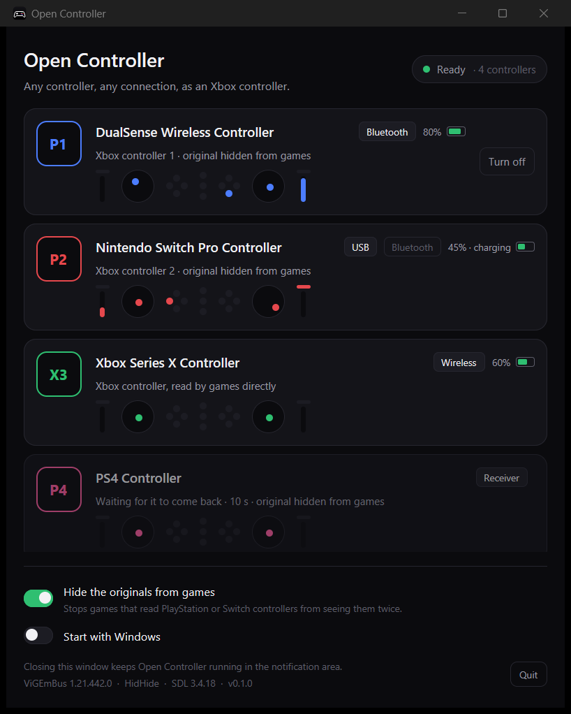

# Open Controller


A Windows app that makes any game controller work in any game. You start it, and every controller
connected to the computer becomes an Xbox controller that games understand: a DualSense on
Bluetooth, a Switch Pro Controller on a cable and a DualShock 4 on Sony's receiver, all at once,
each as its own player. There is nothing to map and nothing to configure.



It does what DS4Windows does for PlayStation controllers, for every brand SDL knows (several
hundred controllers), and keeps out of the way: a resident process of 3.4 MB that adds about
0.6 ms between your controller and the game. Xbox controllers are left alone, since games already
read them. The window is a separate program that only exists while it is open.

Open Controller is open source (MIT) and independent. It is new: the engine is tested end to end
with a simulated controller on Windows 11 (see [Testing](#building-and-testing)), but it has not
yet been run with every kind of physical controller. Treat it as a beta and please report what you
plug in.

## Installing

Open Controller needs two free drivers by Nefarius, the same ones DS4Windows uses:

- [ViGEmBus](https://github.com/nefarius/ViGEmBus/releases/latest) creates the virtual Xbox
  controllers games see. Required.
- [HidHide](https://github.com/nefarius/HidHide/releases/latest) hides the original controllers
  from games, so a game that also understands a DualSense does not see it twice. Optional but
  recommended.

There are no prebuilt binaries yet. With Windows 10 or 11 and [Rust](https://rustup.rs):

```powershell
.\install.ps1     # builds, installs to %LOCALAPPDATA%\Programs\open-controller, adds a Start menu entry and starts it
.\uninstall.ps1   # quits it, shows any hidden controller again and removes the program and its settings
```

Neither script needs administrator rights, and neither does the app. Open Controller lives in the
notification area: its icon opens the window and has "Start with Windows" and "Quit". Closing the
window does not stop anything.

## What it does

Every controller gets a player slot. Games see an Xbox 360 controller in that XInput slot, and the
physical controller shows the same number: the player lights on a DualSense or a Switch controller,
the light bar colour on a DualShock 4 (blue, red, green, pink, as on a PlayStation). Buttons follow
their position, so the bottom face button is A whether it says Cross, B or A. Sticks and triggers
pass through untouched, without a deadzone, as a real Xbox controller's do; the game applies its
own. Rumble goes back the other way, from the game to the controller's motors.

A slot belongs to the controller, not to the connection. A DualShock 4 or DualSense gives the same
Bluetooth address as its serial over Bluetooth and over USB, so plugging a cable into a DualSense
that was on Bluetooth moves it to the cable without the game noticing anything: the virtual controller stays,
same slot, same player. A controller that disappears keeps its slot for 15 seconds, which covers a
cable swap, a Bluetooth reconnect or a receiver hiccup; meanwhile the game sees it at rest. A
controller connected two ways at once (charging over USB while on Bluetooth) is one player, driven
by whichever connection sent the last input.

With HidHide installed, the originals are hidden from games while Open Controller runs and shown
again when it quits. Open Controller only touches its own entries in HidHide's configuration,
writes down what it hid before hiding it, and undoes it on the next start if it was killed in
between. Signing out or shutting down Windows quits it cleanly.

The window shows each controller with its connection (USB, Bluetooth, receiver), battery, slot and
live input. Clicking a controller makes it rumble, to tell which one is which. A Bluetooth
PlayStation or Switch controller can be turned off from there. Xbox controllers are listed but not
duplicated: they are XInput controllers already, so they keep their own slot and add no latency.
The interface is in English or Brazilian Portuguese, following the Windows language.

## Supported controllers

Controllers are read through [SDL 3](https://libsdl.org), which speaks each one's own protocol, plus
the 869 Windows entries of the community [SDL_GameControllerDB](https://github.com/mdqinc/SDL_GameControllerDB)
for generic ones.

| | USB | Bluetooth | Receiver | Notes |
|---|---|---|---|---|
| DualShock 4 (both versions) | yes | yes | Sony USB wireless adaptor | light bar shows the player |
| DualSense, DualSense Edge | yes | yes | | player lights |
| Switch Pro Controller, Joy-Con | yes | yes | | player lights |
| Xbox 360, Xbox One, Xbox Series | yes | yes | Xbox Wireless Adapter | listed, read by games directly |
| 8BitDo, PowerA, Hori, Razer and other licensed pads | yes | yes | yes | by protocol or by the mapping database |
| Generic USB and Bluetooth gamepads | yes | yes | yes | if SDL or the database has a mapping |
| **Tested on hardware so far** | | | | **none yet**: see [Testing](#building-and-testing) |

A device SDL has no button layout for is listed as such and not passed to games.

## How it works

```
crates/
  core/   engine (SDL input, ViGEmBus client, HidHide, slots), the tray/window pipe, texts
  tray/   open-controller.exe: the resident process, a Win32 message loop and the tray icon
  ui/     open-controller-ui.exe: the window, in GPUI, started on demand
```

The engine runs on one thread at multimedia "Games" priority, opted out of Windows 11's power
throttling, which would otherwise slow it down once no window of it is visible, as during a game.
Every millisecond it lets SDL read the controllers, reads the state of each one that sent a report,
and submits a report to the virtual controller if the state changed. Windows' high-resolution timer
wakes on 0.5 ms boundaries, so a plain 1 ms sleep loop runs every 1.5 ms; the engine sleeps to an
absolute deadline instead and runs at 1000 Hz. With nothing connected it polls 50 times a second.

ViGEmBus is driven through its IOCTL interface directly, without ViGEmClient.dll. Each virtual
controller belongs to the engine's handle on the bus, so if the process dies Windows unplugs them:
a crash never leaves phantom controllers. Its own virtual controllers come back through XInput as
new devices; they are recognised by their XInput slot, or by descending from ViGEmBus in the device
tree, and ignored.

The window talks to the resident process over a named pipe private to the user and the session,
with JSON messages: snapshots one way (60 per second while it is open, so the input view is live),
requests the other. While no window is connected, snapshots carry no live input and are only taken
when something changes.

[docs/design.md](docs/design.md) explains the decisions, including what was learned from DS4Windows
and PadForge.

## Measurements

| | Value | How it was measured |
|---|---|---|
| Controller state to what a game reads (XInput) | median 0.58 ms, p99 1.55 ms, max 1.73 ms | `loopback` example, 300 stick moves through the whole engine |
| First input after a controller connects | 34 to 42 ms, once; 1 ms if it comes half a second later | same; the delay is Windows finishing the new virtual controller |
| Report to ViGEmBus | median 16.8 µs, p99 33.5 µs | `latency` example, 1000 reports |
| Poll loop | median period 1.006 ms, 1000 per second (a `sleep(1 ms)` loop: 1.519 ms) | `latency` example, 5000 periods |
| Resident process, memory | 3.4 MB private, 16.1 MB working set, 11 threads | `Get-Process`, window closed, nothing connected |
| Resident process, CPU | 0.10 % of one core with nothing connected, 1.7 to 2.2 % with a controller connected | process CPU time over 30 s and 10 s |
| Window process, memory | 83.7 MB private while open, nothing once closed | `Get-Process` |
| `open-controller.exe` / `open-controller-ui.exe` | 3.3 MB / 6.8 MB | `local` profile, GNU toolchain, no DLLs beyond Windows' own |
| Plugging in a virtual controller | 17 ms; over 1 s the first time on a machine, while Windows installs the Xbox 360 driver | `diagnose` example |

Measured on Windows 11 with ViGEmBus 1.21.442. The working set of the resident process counts
shared system pages; private bytes are what it holds on its own. A first version kept the GPUI
window and the engine in one process, which held 83 MB and 43 threads in the background; splitting
them is why the resident process is small.

## Building and testing

```powershell
cargo build --release
cargo test --workspace
cargo clippy --workspace --all-targets -- -D warnings
```

Release builds of GPUI precompile shaders with `fxc.exe` from the Windows SDK. Without the SDK,
`cargo build --profile local` builds the same optimized programs and compiles the shaders at
start-up. SDL is built from source and linked statically, which needs CMake and a C compiler.
Without the Visual Studio build tools, the GNU toolchain works for this folder
(`rustup override set stable-x86_64-pc-windows-gnu`) with a MinGW gcc on `PATH`.

The 32 tests cover the Xbox report mapping and the stick-noise filter, the slot roster (handoff, grace period, two connections
of one controller), device identity and connection type, the ViGEmBus and HidHide request layouts
and IOCTL codes, HidHide's list handling (other programs' entries survive) and its journal file,
the bundled mappings, the settings file and a real pipe round trip. Three examples talk to the real drivers:

```powershell
cargo run -p open-controller-core --example diagnose            # what SDL sees; plugs one virtual controller and back
cargo run -p open-controller-core --release --example latency   # poll loop and ViGEmBus timings
cargo run -p open-controller-core --release --example loopback  # the whole engine, with a simulated controller
cargo test -p open-controller-core -- --ignored hidhide         # hides a made-up device, shows it, and checks crash recovery
```

`loopback` attaches an SDL virtual controller in the same process and checks, through XInput, that
it gets a slot and its player number, that stick, Y axis and A arrive, that rumble set by a "game"
reaches it, that disconnecting and reconnecting keeps the slot, and that stopping unplugs it. CI
runs the tests and starts both programs on a runner without the drivers.

## Limitations

- Windows only. The engine's input side is SDL and would port; ViGEmBus and HidHide are Windows
  drivers, and Linux would need uinput instead.
- Not yet tested with physical controllers; every claim above about a specific controller is SDL's
  support, not a test of Open Controller.
- ViGEmBus is retired upstream. It is stable and still what DS4Windows uses, but it gets no new
  versions.
- XInput games see at most four controllers. A fifth one gets a virtual controller that only
  DirectInput, Windows.Gaming.Input and GameInput games can see; the window says so.
- Everything is an Xbox 360 controller. Games that show PlayStation button prompts for a DualSense
  will show Xbox ones, and the DualSense's adaptive triggers, touchpad and motion sensors are not
  passed on.
- Hiding needs HidHide, and a game that opened a controller before Open Controller hid it keeps it
  until the game restarts. If Steam Input is on for PlayStation or Switch controllers, Steam reads
  them as well; turn it off for those controllers in Steam's settings.
- When a new controller connects, the engine pauses about 17 ms to plug in its virtual controller.
- No prebuilt or signed binaries yet.

## Disclaimer

Open Controller is not affiliated with Sony, Microsoft, Nintendo or any controller maker; their
names identify compatible hardware only. ViGEmBus and HidHide are by Nefarius Software Solutions;
SDL and SDL_GameControllerDB are under the zlib license. No code from DS4Windows or PadForge is
included.

## License

MIT
